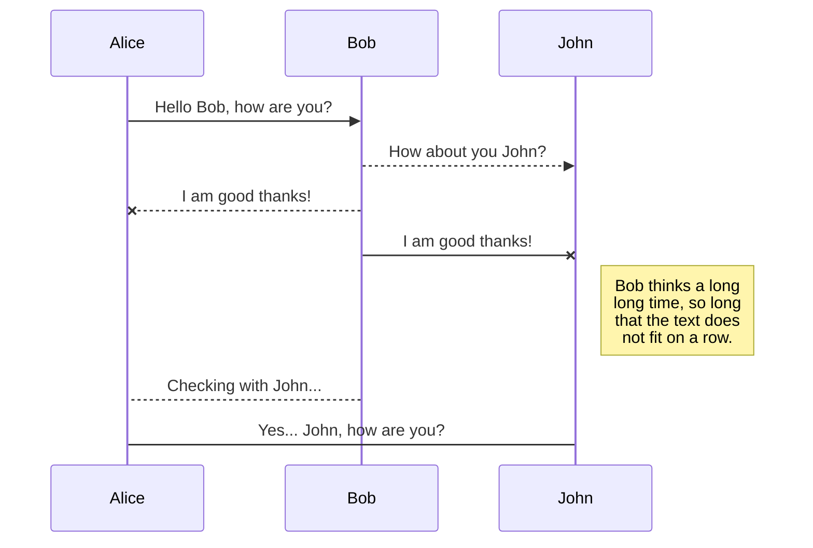
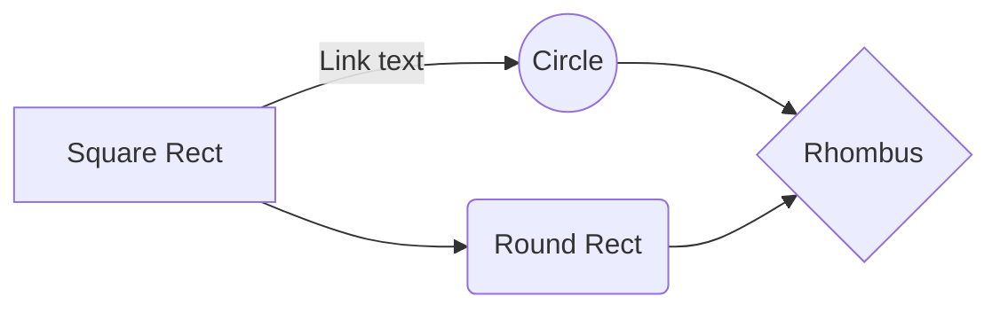

# Algorithme leçon 1


And this will produce a flow chart:


### Premier élément 
#### Instruction de sortie 
Dans un algorithme, nous avons dans un premier temps le texte de début de l'algorithme, pour ensuite faire des actions dans cet algorithme et par la suite terminer chaque premier itération par un "fin". 

- on a donc par exemple `si` et donc on aura `fin si` a la fin de cette itération.

Un code d'algo ressemble normalement à ce type de 
``` algo
Algorithme NomAlgorithme 
Début
	... actions
Fin
```

<!--stackedit_data:
eyJoaXN0b3J5IjpbMTgyMDgzNjg0OCwxMTMxNTgyNDM5XX0=
-->