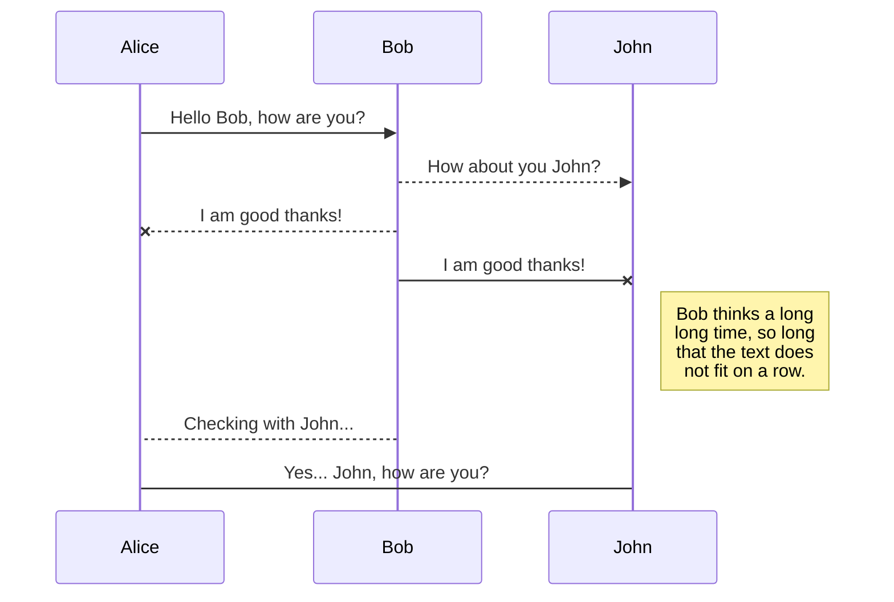
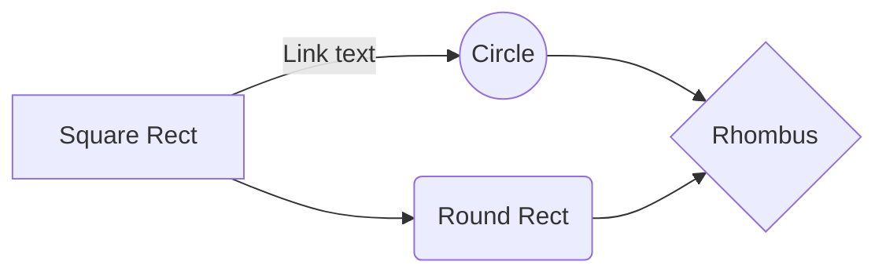

# Algorithme leçon 1


And this will produce a flow chart:


### Premier élément 
#### Instruction de sortie 
Dans un algorithme, nous avons dans un premier temps le texte de début de l'algorithme, pour ensuite faire des actions dans cet algorithme et par la suite terminer chaque premier itération par un "fin". 

- on a donc par exemple `si` et donc on aura `fin si` a la fin de cette itération.

Un code d'algo ressemble normalement à ce type de 
``` algo
Algorithme NomAlgorithme 
Début
	... actions
Fin
```
Nous aurons donc par exemple pour un algorithme de d'affichage de texte : 
```algo 
Alrogithme Bonjour
Début 
	Afficher("Hello Word")
	Afficher("\n")
Fin
```

#### Les boucles 
Pour les boucles, nous avons la réalisation d'une instance jusqu'à ce que celle-ci atteigne un point donné. Nous avons donc pour les boucle for la définition d'une variable (`i` par exemple) et ensuite nous avons l'instance.
```algo
Algorithme CompteJusqueCent
Variable i : entier 
Début 
	Pour i <- 1 à 100 faire
		Écrire(i)
		ALaLigne
	Fin Pour
Fin
```
Lorsqu'on sait exactement combien de fois l'itération doit être effectuée, on peut effectuer ce type de code : 
```algo
Algorithme DessineEtoiles (n:entier)
Variable i:entier
Début 
	Pour i<-1 à n faire
		Ecrire(*)
	Fin Pour
Fin
```
On peut également faire ce type de boucle avec des "tant que" mais à ce moment là il faudra initialiser `i` avec une valeur puis l'augmenter de 1 à chaque passage dans la boucle. Cela donne ce type de code :
```algo
Algorithme CompteJusqueCentVersionTQ
Variable i : entier
Début
	i=1
	Tant que (i<=100) faire
		Ecrire (i)
		ALaLigne
		i<-i+1
	Fin tant que 
Fin
```
On aurait pu penser à ce type de diagramme : 
```algo
Algorithme CompteJusqueCentRecursif (n:entier)
Début 
	Si (n<=100)
	Alors 
		Écrire(n)
		ALaLigne
		CompteJusqueCentRecursif(n+1)
	Fin si
Fin
```
Ou encore avec la boucle répéter (while)
```algo
Algorithme CompteJusqueCentVersionRepeter
Variable i:entier
Début 
	i<-1
	Répéter
		 Écrire(i)
		 ALaLigne
		 i<-i+1
	Jusqu'à (i>100)
Fin
```

<!--stackedit_data:
eyJoaXN0b3J5IjpbMjAwMDIyMTIzOSwxNzk1NDQ4NTg0LDE2Mj
A4MzIwNTgsLTM3NzcwMzE1OSwxMTMxNTgyNDM5XX0=
-->